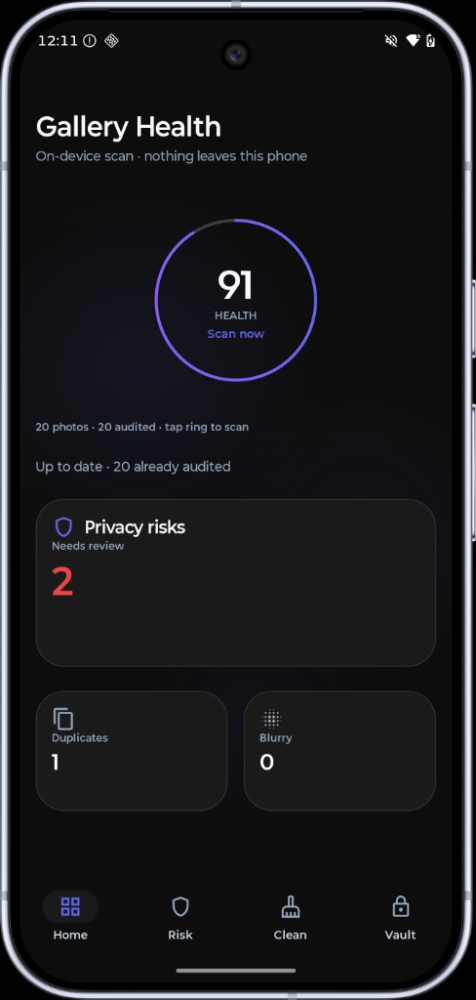
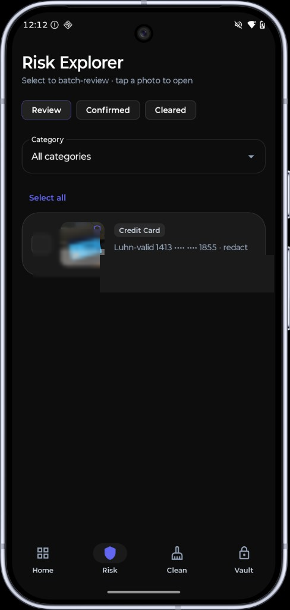
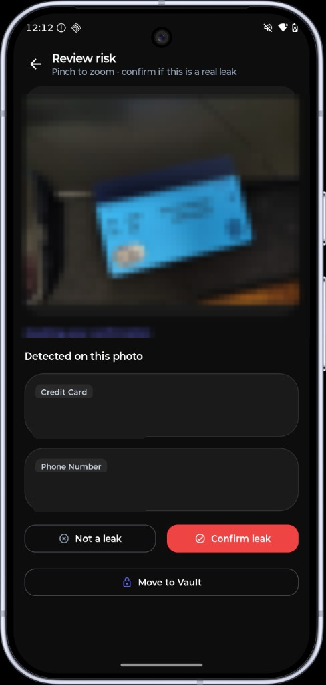
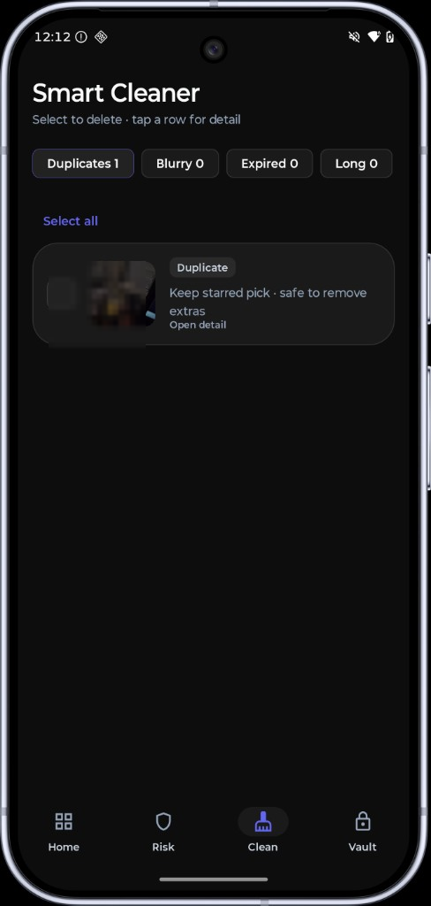
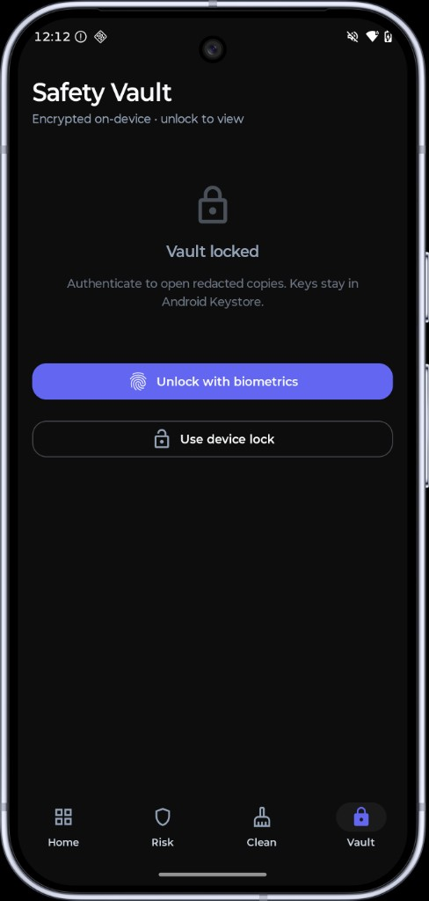

# Skry

**On-device gallery privacy sentinel for Android.**

Skry audits your photo library locally — OCR + rules for privacy leaks, smart cleanup for duplicates and blur, and an encrypted vault for redacted copies. Nothing leaves the device. There is no `INTERNET` permission.

<p align="center">
  
  
  
</p>
<p align="center">
  
  
</p>

> Screenshots above have gallery previews mosaicked for privacy.

---

## Features

| Area | What you get |
|------|----------------|
| **Gallery Health** | Score ring · tap to scan / resume · live risk & cleaner counts |
| **Privacy Audit** | On-device ML Kit OCR + rules (passport, ID, cards, phone, email, EXIF GPS, secrets, …) |
| **Risk Explorer** | Batch confirm / clear · category filter · Review / Confirmed / Cleared |
| **Smart Cleaner** | Near-duplicates (pHash) · blurry · expired / long screenshots · system delete prompt |
| **Safety Vault** | Mosaic sensitive regions · `EncryptedFile` + Keystore · biometric unlock |

## Trust model

1. **Zero network** — `INTERNET` is stripped from the manifest  
2. **Local intelligence** — Bundled ML Kit text recognition; no cloud upload  
3. **App vault only** — Encrypted files under app-private storage (not OEM Secure Folder)

## Stack

Kotlin · Jetpack Compose · Material 3 · Room · WorkManager · ML Kit Text Recognition (bundled) · AndroidX Security Crypto · Biometric

`minSdk 33` · UI: English + 简体中文 (follows system language) · OCR: Latin / English first

## Roadmap

| Status | Item | Notes |
|--------|------|--------|
| Done | Phase 0–1 | Design system, MediaStore + Room index |
| Done | Phase 2 | Privacy OCR + rules (14 categories) |
| Done | Phase 3 | Smart Cleaner (duplicates, blur, expired / long shots) |
| Done | Phase 4 | Safety Vault (mosaic + EncryptedFile + biometric) |
| Done | i18n | English + Simplified Chinese UI resources |
| Planned | In-app language picker | Override system locale without changing device language |
| Planned | More UI locales | e.g. 日本語, Español, Deutsch — string packs only |
| Planned | Phase 5 vision (optional) | Offline TFLite only if a redistributable model exists — handheld ID, hard docs, memes; no self-training |
| Planned | Broader OCR scripts | Non-Latin text recognition where bundled models allow |
| Planned | Vault polish | Batch move-to-vault, export/share redacted copy, clearer delete-original flow |
| Planned | Cleaner polish | Grouped duplicate UI, keep/delete suggestions per cluster |
| Planned | Accessibility | TalkBack labels, larger type scale, contrast audit |
| Maybe | Widget / quick scan | Home-screen health glance — only if it stays fully offline |

See [`docs/SKRY_MASTER_PLAN.md`](docs/SKRY_MASTER_PLAN.md) for detailed phase notes.

## Build

```bash
./gradlew :app:assembleDebug
```

Open in Android Studio (JBR / JDK 17+). Grant `READ_MEDIA_IMAGES`, then tap the health ring to scan.

## Architecture (short)

```
MediaStore → MediaRepository → Room
                 ↓
        FullScanWorker / Scan now
                 ↓
   PrivacyScanner · QualityAnalyzer · VaultService
                 ↓
     Home · Risk · Clean · Vault (Compose)
```

See the [Roadmap](#roadmap) above and [`docs/SKRY_MASTER_PLAN.md`](docs/SKRY_MASTER_PLAN.md) for more.

## License

MIT — see [LICENSE](LICENSE).
